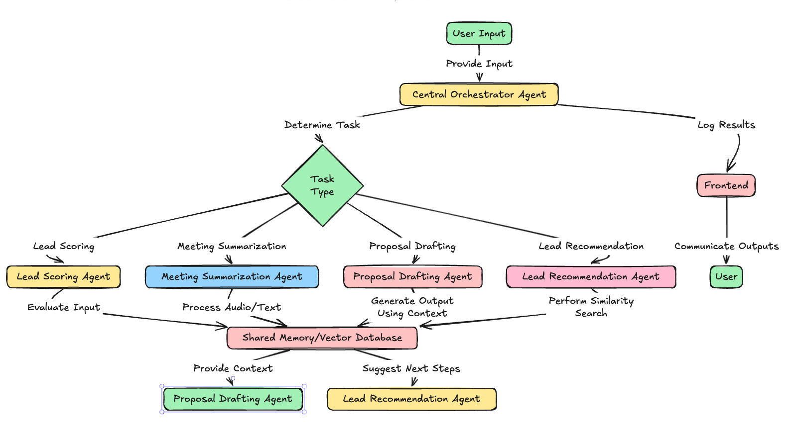

# AI Sales Assistant - Backend

The backend for the AI Sales Assistant automates sales processes such as lead scoring, follow-ups, proposal drafting, and meeting summarization. It manages logic, API endpoints, and integrates with AI models and databases.

## **Architecture**

Below is a high-level architecture diagram of the backend system:

## Features

- **Lead Scoring**: Prioritize leads based on engagement and activity.
- **Follow-Ups**: Automate reminders and email follow-ups.
- **Proposal Drafting**: Generate customized proposals using AI.
- **Meeting Summarization**: Summarize meeting notes or audio.
- **Lead Suggestions**: Recommend similar leads using FAISS.
