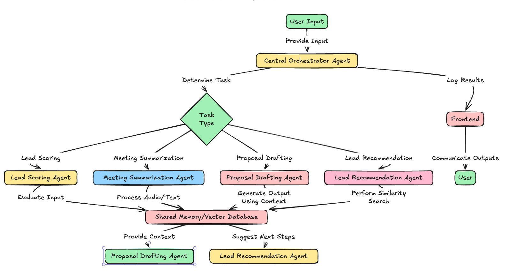

# AI Sales Assistant - Backend
This is the backend for the AI Sales Assistant, a project designed to automate sales processes such as lead scoring, follow-ups, proposal drafting, and meeting summarization. The backend handles the logic, API endpoints, and integration with AI models and databases.
## **Architecture**
Here is a high-level architecture diagram of the backend system:

## Features
Lead Scoring: Prioritize leads based on engagement and activity.
Follow-Ups: Automate reminders and email follow-ups.
Proposal Drafting: Generate customized proposals using AI.
Meeting Summarization: Summarize meeting notes or audio.
Lead Suggestions: Recommend similar leads using FAISS.
